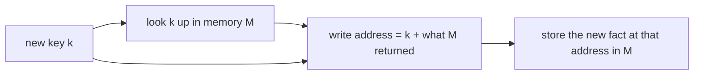
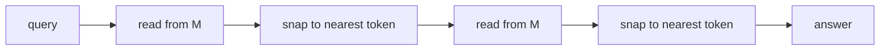
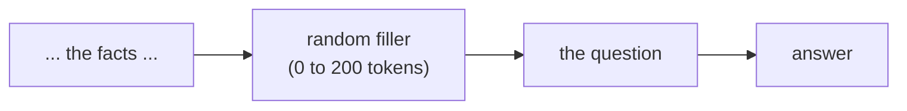

# Fast-weight reasoning

Can a small, cheap, memory-based model learn to *chain facts together* inside a
single pass, the way a transformer does, without paying for attention?

That is the whole question behind this repo. I spent a good while chasing it on
one GPU, and this is the honest write-up of three chapters. The first two are
named after wolves, because I was in that kind of mood; the third is named after
what it does. None of them unseated attention. But each produced a clean,
reproducible result, and together they map out where the wall is and one training
trick that gets through part of it.

This is the plain-language walkthrough. The code is the technical version.

## What "chaining facts" means, and why it is hard

Say the model has read two facts: "Anna's key is red" and "the red key opens the
shed." Now you ask: "what does Anna's key open?" Nothing in the text says
"Anna's key opens the shed" directly. To answer, the model has to make **two
hops**: Anna's key is red (hop one), red opens the shed (hop two), so Anna's key
opens the shed. Following a trail of links like that is called **multi-hop
composition**. It is the simplest form of what people loosely call "reasoning."

Transformers do this well because attention lets any word look directly at any
other word, as many times as there are layers. The catch is that attention is
expensive: its cost grows with the square of the context length, and that is a
big part of why large models cost what they do.

The cheaper family is **state-space models** (SSMs), like Mamba. An SSM reads a
sequence left to right and keeps a fixed-size running summary, instead of
attending over everything. That makes it fast and cheap, but it is famously
weaker at exactly this kind of look-it-up-then-look-again task.

So the prize is obvious: if you could get a cheap recurrent layer to chain
lookups reliably, you would get some of the transformer's reasoning at the
recurrent model's price. For someone building on a single GPU instead of a data
centre, that is the difference between a tractable project and a fantasy.

This repo is my attempt at that prize, and an honest account of how far it got.

## The tool: fast weights

All three chapters lean on an old idea called **fast weights** (Schmidhuber, 1992). The
short version: instead of only storing memories in a fixed vector, the layer
keeps a small **matrix** `M` that it writes to as it reads. Each new key/value
pair gets written into `M` as an outer product (a little grid of key-times-value
numbers). Later, a query multiplied by `M` pulls the matching value back out. It
is an associative memory, a scratchpad the layer fills in and reads back during
the same forward pass.

Plain fast weights can do a single lookup well. The open problem this repo pokes
at is getting them to do lookups *of lookups*, the chaining above.

## Chapter 1: FENRIR, perturb the write address

FENRIR is short for **Fast-weight Eager N-hop Recurrence for Inference and
Retrieval** (yes, it is also a backronym for the great wolf of Norse myth; I was
in that kind of mood).

**The idea.** When the layer writes a new memory into `M`, don't just file it
under its own key. First do a quick lookup of that key in what `M` already holds,
and file the new memory under "its key, plus whatever that key already points
to." In symbols, the write address becomes `k + M·k` instead of just `k`. The
hope is that this small change lets a chain form on its own as the layer writes.



*Folding a lookup into the write address is what lets a freshly written fact
chain onto one already in memory.*

**What actually happened.** It works, but only sometimes, and I can prove what
makes it work.

- Chaining two hops inside one forward pass *is* reachable. On a synthetic
  two-hop task (four candidate answers, so pure guessing scores 25%), the good
  runs reach about 92% to 94%.
- But **whether a run gets there is close to a coin flip.** Training the same
  model with different random starting seeds, about half the runs learn the
  chain and the other half get stuck at the 25% guessing floor. With the better
  of two training schedules, 6 runs out of 10 succeed; with the plainer one, 5
  out of 10. A second version of the operator (looking the address up in the
  other direction) almost never succeeds: 0 of 5, then 1 of 5. I report both
  versions side by side rather than quietly keeping the winner.
- The added lookup term is not decoration, it **is** the mechanism. If I switch
  it off at test time on a model that had learned the task, accuracy falls from
  about 96% to about 3%, which is worse than guessing. If I switch it off during
  training, no run ever learns the task. And in the runs that succeed, the answer
  becomes readable from the third layer's internal state; in the runs that fail,
  it is readable nowhere.

So chapter 1's honest finding is not "new architecture wins." It is: **the
multi-hop wall here is a training-stability problem, not a can't-express-it
problem.** The layer is capable of the chain; getting it to reliably *find* the
chain is the hard part. That, plus a clean way to prove which term does the work.
There is a short paper in `fenrir/paper/` that writes this up formally, and every
number in it traces back to a saved result file in `fenrir/outputs/`.

## Chapter 2: FREKI, move the lookup inside the layer

FREKI is short for **Fixed Read via Explicit K-chain Iteration**, which is a fancy
way of saying "read K times on purpose." (Also a wolf: where Fenrir is the
adversary, Freki is one of Odin's two companion wolves, which felt about right for
the primitive that escapes the first one's pathology.)

Chapter 1 left me with a coin flip. Chapter 2 asks: what if, instead of hoping a
chain forms during writing, I just *build the chaining into the read*?

**The idea.** After writing all the memories into `M`, read from it several times
in a row within the same layer: look up the query, take what comes back, look
*that* up, and so on, once per hop. Between hops, snap the intermediate result
onto the nearest real token ("cleanup"), so noise does not pile up across hops.



*The read runs several times inside one layer, cleaning up between hops, so a
single query can follow a chain of facts.*

I want to be upfront about where this sits. This is **not** a brand-new
mechanism. Reading a fast-weight memory several times inside one layer, with a
normalization step between hops, is the core of **Fast Weight Memory** (Schlag,
Munkhdalai, and Schmidhuber, 2021), which introduced it for exactly this kind of
transitive lookup. The between-hop cleanup is the idea behind **Resonator
Networks** (Frady et al., 2020). What I add is an engineering recipe that makes
the thing train *reliably*, and a baseline that isolates what is doing the work.

**What actually happened.** The chaining became dependable.

- On the two-hop task, the recipe passes **10 runs out of 10**, versus the coin
  flip from chapter 1.
- On a harder three-hop task with a realistic-sized vocabulary (512 possible
  entities), it passes **all 3 runs**, at around 99% accuracy.
- The recipe has four ingredients (a subtractive "delta-rule" write, the
  between-hop cleanup, a small helper training signal, and an easy-to-hard
  curriculum), and each fixes an independent failure. Removed one at a time,
  the pass rate drops step by step.

**The result I trust most is the one where nothing works.** I ran a plain version
(a standard delta-rule memory, three layers stacked, no chained read, no
cleanup) on the same three-hop task. It scored **3 out of 3 at the guessing
floor**: it never learned the task at all. That negative control is the point.
It shows the chained-read-plus-cleanup stack is not window dressing; it is
carrying the whole result. Plain stacked memory layers simply cannot compose
three hops at this vocabulary size.

## Chapter 3: filler-augmented training, get through the depth wall

Chapters 1 and 2 were about getting the chain to form at all. Chapter 3 is about
what happens when you push the *same* fast-weight mixer deeper, to five and six
hops, where it starts falling apart in three tangled ways at once: it leans on the
tokens next to the question instead of its memory, its internal state blows up on
long inputs, and past a certain depth no healthy run forms at all.

**The idea.** Change nothing about the model. Just change training: sprinkle a
random number of "filler" tokens between the last fact and the question, ramped in
after a warm-up. If the gap between the facts and the question keeps changing, the
model cannot lean on whatever sits next to the question, so it has to use its
memory instead, and that turns out to fix all three failures together.



*Varying the gap between facts and question during training forces the model onto
its memory rather than onto nearby tokens.*

**What actually happened.** At six hops the plain recipe produces no healthy runs;
the filler recipe restores a 4-of-5 pass rate, and it holds from three hops up to
six. This is the most "it worked" of the three chapters, with one honest catch: at
depth the trick biases the model toward expecting filler, so the passing runs
increasingly need some filler present at test time to hit their best accuracy. It
buys robustness to separation, not a free lunch. Full numbers are in
`filler/README.md`, and this chapter has its own short paper in `filler/paper/`.

## Where the wall actually is (the honest part)

I did not get a cheap recurrent layer that reasons like a transformer. Here is
what stopped me, stated plainly so nobody has to reverse-engineer it from the
numbers:

- **Some of the best numbers are single runs, not averages.** The three-hop
  result at the largest vocabulary I tried (2048 entities) comes from a *single*
  training run that I had to nurse along, not a clean multi-seed sweep. It is
  labelled as such wherever it appears. Treat single-run frontier numbers as
  "this is possible," not "this is reliable."
- **It did not transfer to real language.** When I mixed the chain task into
  ordinary next-token language-model training, it failed completely (0 of 3 runs
  above the guessing floor). The diagnosis: the memory needs to *choose* what is
  worth writing down, and a plain delta-rule write does not have that
  content-based selectivity. That is a real limitation, not a tuning miss.
- **All three chapters are honest about novelty.** FENRIR's paper explicitly makes
  no claim of a new primitive; its contribution is the mechanistic characterization
  and a reproduction workflow you can audit. FREKI builds directly on Fast Weight
  Memory and Resonator Networks, as above. Chapter 3 is a training recipe, not a
  new mechanism. I chased "be the first" for a while on this line of work, and the
  more useful thing turned out to be building carefully on what already exists and
  reporting exactly what happened.

If you want the one-line takeaway: **plain recurrent memory cannot chain lookups
at any real scale, an in-layer chained read with cleanup can, and getting it to
train reliably is a recipe problem with a clear negative control.**

## The chapters are wired together

They are not three loose folders. FREKI's `rig_000` imports the actual FENRIR
mixer from chapter 1 and runs it through chapter 2's training harness, to confirm
the two codebases agree on the baseline before anything is compared. And chapter 3
trains chapter 1's own eager-closure mixer, so the filler result is about the very
same primitive, just pushed deeper. Chapter 1's mechanism runs through all three.

## How to run it

Everything is plain PyTorch. A GPU reproduces the headline numbers; a CPU is
enough to run the plumbing and the FENRIR audit tests.

```bash
python -m venv .venv
. .venv/bin/activate
pip install -r requirements.txt

# Chapter 1: the audit tests must pass first (they check every convention the
# paper relies on), then a single training run.
cd fenrir
pytest tests/                          # 42 checks, ~3s on CPU
python train.py --variant rev --seed 0 --K1 4

# Chapter 2: the headline two-hop result, the three-hop recipe, and the control.
cd ../freki
python rig_003_freki/run.py --seeds 0 1 2 3 4 --steps 12000   # two-hop, 10/10
python rig_010_arm2_plus_arm3/run.py                          # three-hop recipe, 5/5
python rig_013_delta_write/run.py \
  --K-chain 1 --aux-lambda-init 0 --sym-lambda-init 0         # the plain baseline that fails at chance

# Chapter 3: the six-hop depth wall, baseline vs the filler recipe.
cd ../filler
python experiments/01_depth_wall_hops6.py --full             # baseline n=3 + filler n=5
```

Each chapter has its own README with the full reproduction details and the
result tables.

## Layout

```
fast-weight-reasoning/
  README.md              this file (the human version of the whole arc)
  requirements.txt       torch, numpy, scikit-learn, einops, pytest
  fenrir/                Chapter 1: perturb the write address
    README.md            chapter write-up + reproduction
    model.py             the FENRIR mixer (two operator variants)
    train.py, eval.py    training and the multi-hop accuracy ladder
    tests/               audit-as-code: every convention the paper claims
    outputs/             the saved result files the paper reads from
    paper/               the compiled short paper (PDF + LaTeX source)
  freki/                 Chapter 2: move the lookup inside the layer
    README.md            chapter write-up + reproduction + result tables
    common/              the shared multi-hop benchmark and training harness
    rig_003_freki/       the winning two-hop recipe
    rig_010_arm2_plus_arm3/  the three-hop recipe (all ingredients stacked)
    rig_013_delta_write/ the delta-rule write and the negative control
    rig_000_..rig_018_/  the full ladder of attempts, including the dead ends
  filler/                Chapter 3: a training trick that extends depth
    README.md            chapter write-up + reproduction + result table
    model.py             chapter 1's eager-closure mixer + chunk-parallel kernel
    nhop_task.py         the N-hop chain task and the filler insertion
    probe.py             div_norm + the query-conditioning probe
    experiments/         01 the six-hop depth wall, 02 the depth sweep
```

## Credit where it is due

- **Fast weights**: Schmidhuber, 1992.
- **Self-Referential Weight Matrix (SRWM)**: Schlag et al., 2021 (arXiv:2202.05780).
- **DeltaNet / the delta rule**: the write that erases before it stores.
- **Fast Weight Memory (FWM)**: Schlag, Munkhdalai, Schmidhuber, 2021
  (arXiv:2011.07831). Chapter 2's in-layer chained read comes straight from here.
- **Resonator Networks**: Frady et al., 2020. The between-hop cleanup.
- **Soft Thinking**: arXiv:2505.15778. A modern cousin of the cleanup idea.

MIT licensed. Built by one person on one GPU, and written to be readable by
non-specialists.
